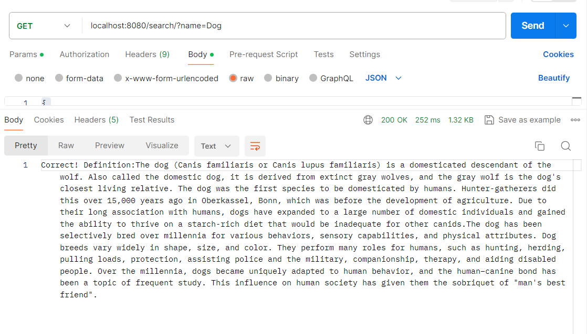

# Data from Wikipediaxxxx

# Project Description
This service is designed to retrieve definitions of words. If the term is already present in the database, the service outputs its definition. Otherwise, it requests permission to search the Wikipedia API, and then displays a brief list of pages. The user selects the desired page, and then retrieves its content, which is then stored in the database.
xx
## SonarCloud

https://sonarcloud.io/project/overview?id=sashkagr_MediaWiki

## Requirements
The project utilizes Spring Boot, Gradle, and MySQL (any database can be connected). Database operations are performed using JPA repository. It is mandatory to create the ```application.properties``` file.
* Dependencies of the project (build.gradle)
``` implementation 'org.json:json:20211205'
    implementation 'org.springframework.boot:spring-boot-starter-data-jpa'
    implementation 'org.springframework.boot:spring-boot-starter-web'
    implementation 'org.projectlombok:lombok:1.18.22'
    implementation 'mysql:mysql-connector-java:8.0.27'
    runtimeOnly 'com.mysql:mysql-connector-j'
```
* Plugins
``` id 'org.springframework.boot' version '2.6.3'
    id 'io.spring.dependency-management' version '1.0.11.RELEASE'
 ```
* Work with annotations
```configurations {
    compileOnly {
        extendsFrom annotationProcessor
    }
 ```    
    
## Installation and Running
* Configure Spring Boot Application in the ```Main class```. 
* Make sure you have connected to the database. 
The database consists of three columns: id (int primary key auto incremented), title (varchar(255) unique), description (TEXT). 
* Configure the ```application.properties``` file as shown in the example. 
```
server.port=8080 //you can change ports for server and database
spring.datasource.url = jdbc:mysql://localhost:3306/mediawiki 
spring.datasource.username = <username of your database>
spring.datasource.password = <password of your database>
spring.jpa.hibernate.ddl-auto=update
spring.jackson.serialization.FAIL_ON_EMPTY_BEANS=false
```
* It is recommended to install Postman, from which requests will be sent.

To work with all requests related to this code, enter the URL in the following format: ```http://localhost:8080/search```. 
* Use ```@GetMapping``` (GET request in Postman). 
To enter a word for search:
```
http://localhost:8080/search/?name=<your word>
``` 
To allow access to the Wikipedia API: 
```
http://localhost:8080/search/answer/?answer=Yes
```
To select the desired article from the list: 
```
http://localhost:8080/search/answer/?answer=<index of article>
```
Then the article will be added to the database.
* Use ```@PostMapping``` (POST request in Postman). 
To add a word and its definition to the database, enter the URL:
```
http://localhost:8080/search/add
```
Then open the  ```Body``` tab, select ```raw```, and enter the request in JSON format:
```
{
"title": "Apple",
"description": "An apple is a round, edible fruit produced by an apple tree Apple trees are cultivated worldwide and are the most widely grown species in the genus Malus."
}
```
* Use ```@DeleteMapping``` (DELETE request in Postman). 
To delete a record from the database, you need to know its ```id```.
Enter:
```
http://localhost:8080/search/delete/<your id>
```
* Use ```@PutMapping``` (PUT request in Postman). 
To update a record in the database, you need to know its id. 
Enter: 
```
http://localhost:8080/search/update/<your id>
```
Then open the  ```Body``` tab, select ```raw```, and enter the request in JSON format:
```{
    "title": "Dog",
    "description": "Dog is a cute animal."
}
```
Note that instead of port ```8080```, write your port that you specified in ```application.properties```.
## Usage Examples
* GET request 

* PUT request

## API Documentation
The Wikipedia API is used https://habr.com/en/articles/104480/. 
To request a list of pages for the entered word in JSON format, use the URL string:
https://en.wikipedia.org/w/api.php?action=query&list=search&srsearch=Apple&srwhat=text&format=json.
Replace ```Apple``` with the requested word. 
Each page has its own ```pageId```. To request data from this page later, use the URL string: 
https://en.wikipedia.org/w/api.php?action=query&prop=extracts&format=json&pageids=18978754.
Replace ```18978754``` with the required ```pageId```.


